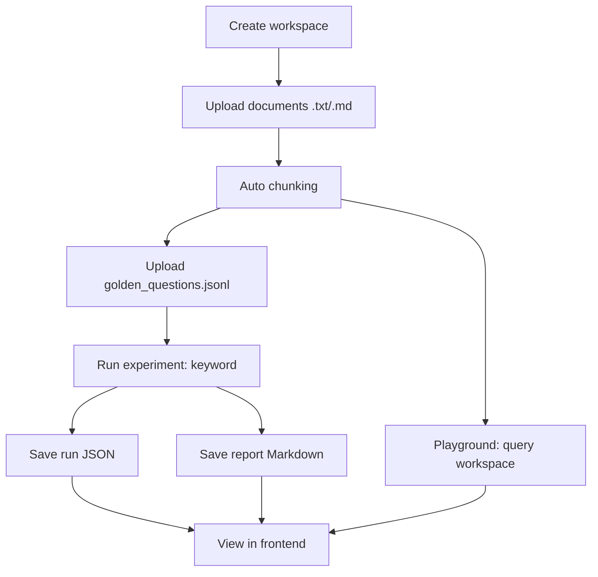

# System Map (Mental Model)

Muc tieu cua file nay: cho phep nhin du an bang "so do" thay vi doc tung file.
No tap trung vao flow dang chay (workspace-first + keyword baseline + reports).

## 1) Product Loop (dang dung)



## 2) Backend Request Flow (layering)

Quy uoc:
- Route: nhan HTTP request, validate schema
- Service: xu ly logic, doc/ghi file local
- Storage: hien tai nam trong `data/` (khong co DB)

```mermaid
flowchart LR
  FE[Frontend React] -->|HTTP JSON| API[FastAPI routes]
  API --> SCH[Schemas (Pydantic)]
  API --> SVC[Services]
  SVC --> FS[Local file storage: data/workspaces/*]
```

## 3) Workspace API Map (primary)

File route chinh: `app/api/routes/workspaces.py`

```mermaid
flowchart TD
  subgraph WS[Workspaces Domain]
    W1[POST /workspaces] --> WSVC[workspace_service.create_workspace]
    W2[GET /workspaces] --> WSVC2[workspace_service.list_workspaces]
    W3[GET /workspaces/{id}] --> WSVC3[workspace_service.get_workspace]
    W4[PATCH /workspaces/{id}] --> WSVC4[workspace_service.rename_workspace]
    W5[DELETE /workspaces/{id}] --> WSVC5[workspace_service.delete_workspace]
  end

  subgraph DOCS[Workspace Documents]
    D1[POST /workspaces/{id}/documents/upload] --> DSVC[document_service.save_uploaded_document]
    D2[GET /workspaces/{id}/documents] --> DSVC2[document_service.list_documents]
    D3[GET /workspaces/{id}/documents/{doc_id}] --> DSVC3[document_service.get_document]
    D4[DELETE /workspaces/{id}/documents/{doc_id}] --> DSVC4[document_service.delete_document]
  end

  subgraph R[Workspace Research]
    R1[POST /workspaces/{id}/research/retrieve] --> RSVC[retrieval_service.retrieve_relevant_chunks]
    R2[POST /workspaces/{id}/research/query] --> RAGSVC[rag_service.answer_research_query]
  end

  subgraph EVAL[Golden Questions]
    Q1[POST /workspaces/{id}/eval/questions/upload] --> QSVC[eval_question_service.upload_eval_questions_file]
    Q2[GET /workspaces/{id}/eval/questions] --> QSVC2[eval_question_service.list_eval_questions]
    Q3[DELETE /workspaces/{id}/eval/questions/{q_id}] --> QSVC3[eval_question_service.delete_eval_question]
  end

  subgraph EXP[Experiments + Reports]
    X1[POST /workspaces/{id}/experiments/run] --> XSVC[experiment_service.run_workspace_experiment]
    X2[GET /workspaces/{id}/experiments] --> XSVC2[experiment_service.list_workspace_experiments]
    X3[GET /workspaces/{id}/experiments/{run_id}] --> XSVC3[experiment_service.get_workspace_experiment]
    X4[GET /workspaces/{id}/reports/{run_id}] --> XSVC4[experiment_service.get_workspace_report_markdown]
  end
```

## 4) Retrieval + RAG (hien tai)

Hien tai:
- Retrieval: keyword-only (khong vector)
- RAG: mock answer (khong goi LLM that)

```mermaid
flowchart TD
  U[Question] --> K[_extract_keywords()]
  K --> S[Score chunks by count()]
  S --> Top[Top-k RetrievedChunks]
  Top --> Src[ResearchSource list + preview]
  Src --> Ctx[Build context text]
  Ctx --> Mock[ai_service.generate_mock_answer]
  Mock --> Resp[Return answer + sources]
```

## 5) Local Data Layout (source of truth)

Workspace data:

```text
data/workspaces/metadata.json
data/workspaces/{workspace_id}/metadata.json
data/workspaces/{workspace_id}/documents/{doc_id}_{file_name}
data/workspaces/{workspace_id}/eval_sets/golden_questions.jsonl
data/workspaces/{workspace_id}/experiments/run_*.json
data/workspaces/{workspace_id}/reports/run_*.md
```

Global legacy data (khong phai flow chinh nua):

```text
data/metadata.json
data/documents/*
```

## 6) "Folder co nhung chua active"

Nhung folder nay co the la scaffold/y tuong, chua duoc wired vao flow workspace-first:

```text
app/ingestion/
app/embeddings/
app/retrieval/
app/generation/
app/evaluation/
app/database/
```

`app/vectorstore/` co client Chroma, nhung "vector retrieval strategy" chua duoc integrate vao:
- `app/services/retrieval_service.py`
- `app/services/experiment_service.py`

